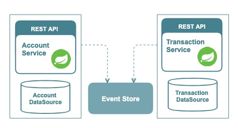

# American Orange Cadillac
#### A blueprint of Event-Driven Microservices

American Orange Cadillac is a simple accounting system, which exposes an API for opening accounts for existing customers.
The API accepts information like customerId and initialCredit.
Once the API is called, a new account will be opened connected to the customerId.
Also, a new transaction is sent to the new account if the initialCredit is not 0.
Another API is exposed to get account information with its transactions.
We assume American Orange Cadillac has a large customer base and is still growing with new accounts and customers. 
And the system continuously requires to support all type of concurrent transactions for their accounts. Considering 
the fact that requirement for reliable, and scalable transactions handling system with high availability, 
the following microservices architecture is proposed.

### Architecture Overview
The system is divided into two main services, AccountService and TransactionService. 

The mains architecture reasoning behind the separation are;
- AccountService and TransactionService are microservices, which has its unique scalability requirement. That is, 
the system should 
allow onboarding new accounts, and should not be affected by the performance of transaction handling.
- TransactionService could be used by other parts of the system, which are only communicated over the events. 
- AccountService publishes transaction events, which is eventually recorded in the TransactionService.
- Event Source is a message broker which decouples the microservices AccountService and TransactionsService. 
The message broker can be a reliable distributed system like [Kafka](https://kafka.apache.org/), but in this work, 
[RabbitMQ](https://www.rabbitmq.com/) is used for easy demonstrate.
- AccountService and TransactionsService as microservices have its data source. [H2](https://www.h2database.com/html/main.html) in-memory database is used in this work. 
In real work, each service may have a different database system to support its storage and transactions requirement. 
For example, TransactionService may expect high throughput of transaction events. A distributed storage system like 
[Cassandra](http://cassandra.apache.org/) might be relevant for it as the database system.
- As microservices, AccountService and TransactionService are fully decoupled by its design. AccountService 
follows [the separate way](#) pattern to avoid any integration with TransactionService. 
- The containerized microservices are expected to deploy on [kubernetes](https://kubernetes.io/). The microservices will
follow [Serverside Service Discovery](#) with use of kubernetes Service descriptors. 
