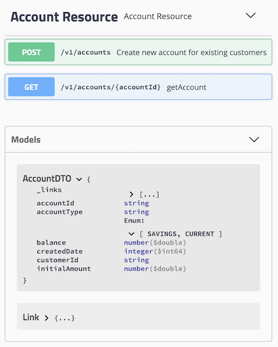
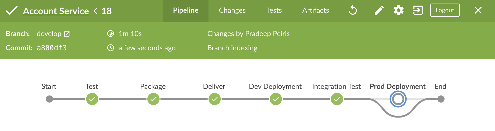

# Account Service
Account Service exposes RESTful APIs for manging customer accounts.

### Prerequisite
- Java 12
- Maven 3

### REST API Endpoints
The API documentation is generated with swagger and exposed at the endpoint:

http://[host]:9090/swagger-ui.html

### CI/CD with Jenkins

Account Service application is integrated with Jenkins to automate the CI/CD process.

