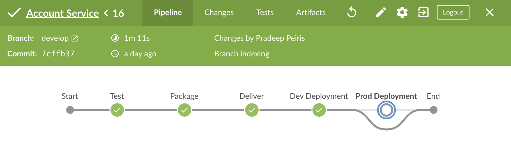

# Account Service
Account Service exposes RESTful APIs for manging customer account.

### Running Account Service
#### Run and Test as standalone application 

Prerequisite:
- Java 12
- Maven 3

To execute unit test
```
mvnw clean test
```

To run the application
```
mvnw spring-boot:run
```

#### Run the application with docker
To build docker image
```
docker build -t american-orange-cadillac-accounts:0.1 .
``` 

To run the application in docker image
```
docker run -p 9090:9090 american-orange-cadillac-accounts:0.1 
```

### REST API Endpoints
The API documentation is generated with swagger and exposed at the endpoint:

http://[host]:9090/swagger-ui.html


### CI/CD with Jenkins

Account Service application is integrated with Jenkins to automate the CI/CD process.

