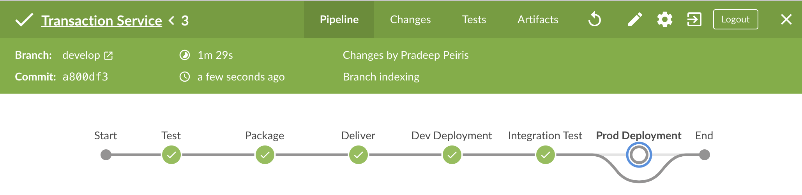

# Transaction Service
Transaction Service exposes RESTful APIs for listing transactions.

### Prerequisite
- Java 12
- Maven 3

### REST API Endpoints
The API documentation is generated with swagger and exposed at the endpoint:

http://[host]:9091/swagger-ui.html

### CI/CD with Jenkins

Transaction Service application is integrated with Jenkins to automate the CI/CD process.

